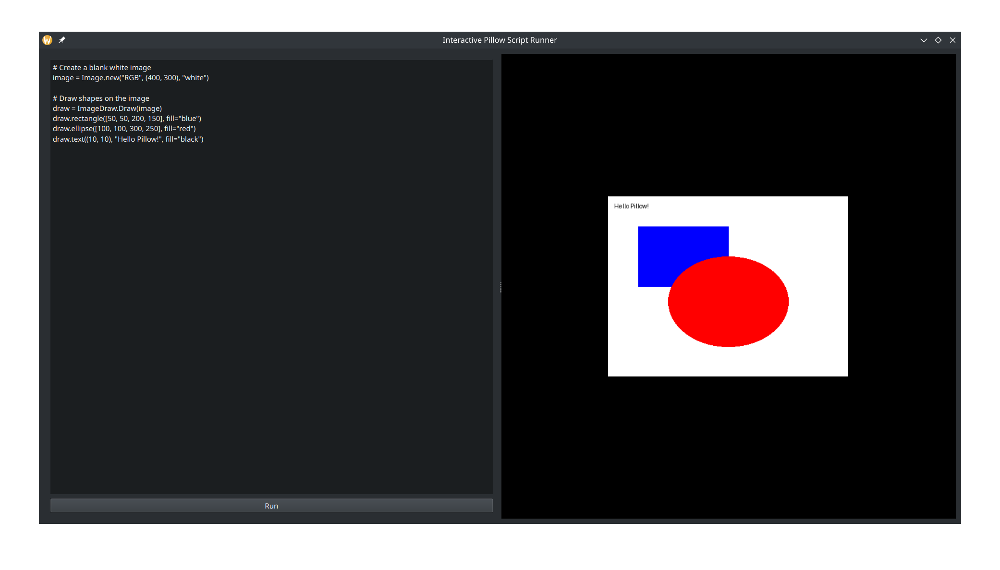

# Pillow Script Runner with PySide6 🎨

An interactive GUI application built with **PySide6** that allows you to write and execute **Pillow** drawing scripts in real-time. This tool is perfect for experimenting with Pillow's capabilities and visualizing your creations immediately!

## Features ✨
- **Code Editor**: Write Python code using Pillow on the left panel.
- **Dynamic Canvas**: The right panel displays the result of your Pillow script execution.
- **Real-Time Execution**: Click the "Run" button to instantly generate and view your drawing.
- **Error Handling**: Displays detailed error messages if your code contains any issues.
- **Responsive Layout**: Adjustable panels to optimize your workflow.

## How It Works 🛠️
1. Write your Pillow drawing script in the left editor.
   - Your script must define a Pillow `Image` object named `image`.
2. Click the **Run** button to execute your code.
3. View the generated image on the right panel.

### Example Script:
```python
# Create a blank white image
image = Image.new("RGB", (400, 300), "white")

# Draw shapes on the image
draw = ImageDraw.Draw(image)
draw.rectangle([50, 50, 200, 150], fill="blue")
draw.ellipse([100, 100, 300, 250], fill="red")
draw.text((10, 10), "Hello Pillow!", fill="black")
```

## Installation 🚀
1. Clone the repository:
   ```bash
   git clone https://github.com/yourusername/pillow-script-runner.git
   cd pillow-script-runner
   ```
2. Install the dependencies:
   ```bash
   pip install -r requirements.txt
   ```
3. Run the application:
   ```bash
   python main.py
   ```

## Dependencies 📦
- **PySide6**: For the GUI framework.
- **Pillow**: For creating and manipulating images.

Install all dependencies using:
```bash
pip install PySide6 Pillow
```

## Screenshots 🖼️


## Future Improvements 🛠️
- Add a **Save Image** button to download generated images.
- Support for custom image sizes via input fields.

## License 📜
This project is licensed under the MIT License.
